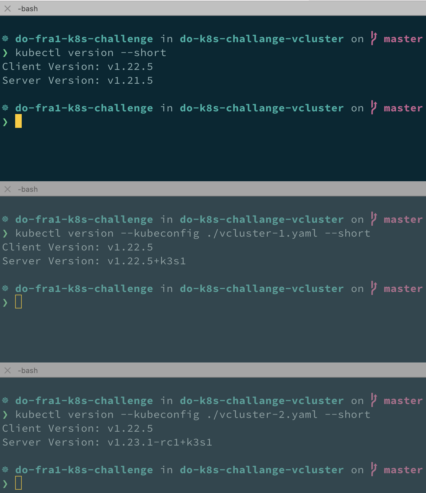
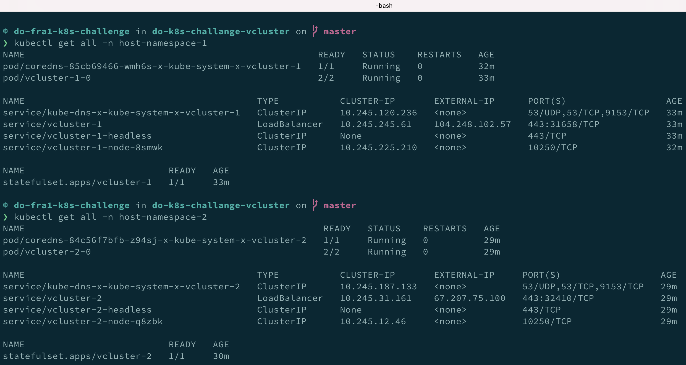
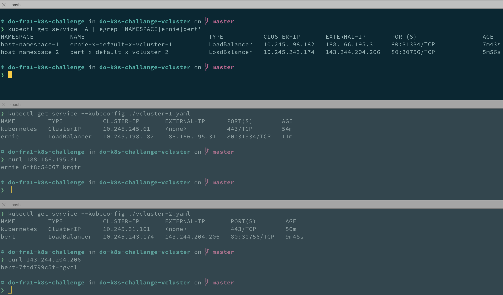
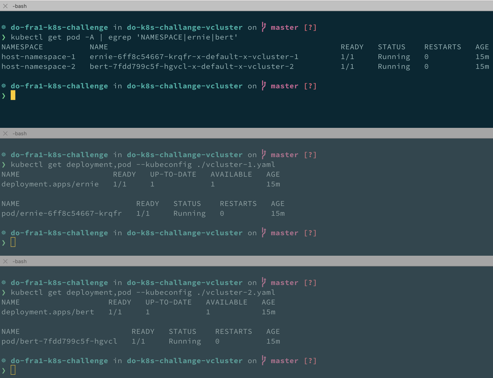

# do-k8s-challange-vcluster
DigitalOcean Kubernetes Challenge - Deploy a virtual cluster solution

From the [DigitalOcean Kubernetes Challenge](https://www.digitalocean.com/community/pages/kubernetes-challenge) homepage:

> Install [vcluster](https://www.vcluster.com/) to test upgrades (eg. 1.20 to 1.21 DOKS version) of your cluster. With a virtual cluster, you can create a new Kubernetes cluster inside your existing DOKS cluster, test the application in this new vcluster, and then upgrade your original cluster if everything works well with the new version. Blogpost: [High-Velocity Engineering with Virtual Kubernetes Clusters](https://loft-sh.medium.com/high-velocity-engineering-with-virtual-kubernetes-clusters-7df929ac6d0a)

---

## Approach to complete the challenge:

- [create a DOKS Kubernetes cluster using doctl](#create-a-kubernetes-cluster-using-doks)
- [install vcluster using the vcluster cli](#install-vcluster)
- [Experiment with two vclusters running different versions than the host Kubernetes cluster](#experiment)

---

## Experiment

After creating the host Kubernetes cluster and being able to create a basic vcluster.

### Create two vclusters in the same host Kubernetes cluster running different versions  
- hosting cluster : v1.21.5
- vcluster 1: v1.22.5
- vcluster 2: v1.23.1

```
❯ CLUSTER_NAME=k8s-challenge
❯ doctl kubernetes cluster create $CLUSTER_NAME --version 1.21.5-do.0 --count 3 --size s-4vcpu-8gb --region fra1
❯ vcluster create vcluster-1 -n host-namespace-1 --expose --k3s-image rancher/k3s:v1.22.5-k3s1
❯ vcluster create vcluster-2 -n host-namespace-2 --expose --k3s-image rancher/k3s:v1.23.1-rc1-k3s1

# Open two more terminals
# terminal 0: hosting Kubernetes cluster
# terminal 1: vcluster-1
# terminal 2: vcluster-2

(in terminal 1):
❯ vcluster connect vcluster-1 --namespace host-namespace-1
❯ mv kubeconfig.yaml vcluster-1.yaml

(in terminal 2):
❯ vcluster connect vcluster-2 --namespace host-namespace-2
❯ mv kubeconfig.yaml vcluster-2.yaml
```

### Verify the versions of the three Kubernetes clusters
```
(in terminal 0):
kubectl version --short

(in terminal 1):
❯ kubectl version --kubeconfig ./vcluster-1.yaml --short

(in terminal 2):
❯ kubectl version --kubeconfig ./vcluster-2.yaml --short
```


### Check the deployed objects on the host Kubernetes cluster
```
(in terminal 0):
❯ kubectl get all -n host-namespace-1
❯ kubectl get all -n host-namespace-2
```


### Deploy a workload to both vclusters, expose and access them
```
(in terminal 1):
❯ kubectl create deployment ernie --image=recollir/gasthear:latest --kubeconfig ./vcluster-1.yaml
❯ kubectl expose deployment ernie --kubeconfig ./vcluster-1.yaml --port=80 --target-port=8080 --type=LoadBalancer
❯ kubectl get service --kubeconfig ./vcluster-1.yaml
❯ curl <external-ip>

(in terminal 2):
❯ kubectl create deployment bert --image=recollir/gasthear:latest --kubeconfig ./vcluster-2.yaml
❯ kubectl expose deployment bert --kubeconfig ./vcluster-2.yaml --port=80 --target-port=8080 --type=LoadBalancer
❯ kubectl get service --kubeconfig ./vcluster-2.yaml
❯ curl <external-ip>
```


### Check deployments and pods


---

## Create a Kubernetes cluster using DOKS
[DOKS (DigitalOcean managed Kubernetes Service)](https://www.digitalocean.com/products/kubernetes/)

- Install doctl and kubectl/helm
```
❯ brew install doctl
❯ brew install kubectl
❯ brew install helm
```
- Create an API token (to be used in the next step)  
Go to [DO API tokens](https://cloud.digitalocean.com/account/api/tokens)
- Authenticate doctl
```
❯ doctl auth init
```
- Create Kubernetes cluster
```
❯ CLUSTER_NAME=k8s-challenge
❯ doctl kubernetes cluster create $CLUSTER_NAME --version 1.21.5-do.0 --count 3 --size s-4vcpu-8gb --region fra1
```
- Get the Kubernetes cluster name and kubeconf
```
❯ doctl kubernetes cluster list
❯ doctl kubernetes cluster kubeconfig show $CLUSTER_NAME
❯ doctl kubernetes cluster kubeconfig save $CLUSTER_NAME
```
- Check access to the Kubernetes cluster
```
❯ kubectl get nodes
```
- Delete the Kubernetes cluster and kubeconf
```
❯ doctl kubernetes cluster list
❯ doctl kubernetes cluster kubeconfig rm $CLUSTER_NAME
❯ doctl kubernetes cluster rm $CLUSTER_NAME
```

---

## Install vcluster
[vcluster](https://www.vcluster.com)

Based on the [_getting started_ full guide](https://www.vcluster.com/docs/getting-started/setup).  
**Requirement:** access to a running Kubernetes cluster
- Install the vcluster cli
```
❯ curl -s -L "https://github.com/loft-sh/vcluster/releases/latest" | sed -nE 's!.*"([^"]*vcluster-darwin-amd64)".*!https://github.com\1!p' | xargs -n 1 curl -L -o vcluster && chmod +x vcluster
❯ sudo mv vcluster /usr/local/bin
❯ vcluster --version
```
- Create a vcluster using the vcluster cli
```
❯ vcluster create vcluster-1 -n host-namespace-1
```
Output of command:
```
[info]   Creating namespace host-namespace-1
[info]   execute command: helm upgrade vcluster-1 vcluster --repo https://charts.loft.sh --version 0.4.5 --kubeconfig /var/folders/nz/79xvvg853p7dxf4gkc8xstq40000gn/T/746245930 --namespace host-namespace-1 --install --repository-config='' --values /var/folders/nz/79xvvg853p7dxf4gkc8xstq40000gn/T/823828609
[done] √ Successfully created virtual cluster vcluster-1 in namespace host-namespace-1. Use 'vcluster connect vcluster-1 --namespace host-namespace-1' to access the virtual cluster
```
- Objects created in the hosting cluster:
```
❯ kubectl get ns
NAME               STATUS   AGE
default            Active   13m
host-namespace-1   Active   2m33s
kube-node-lease    Active   13m
kube-public        Active   13m
kube-system        Active   13m

❯ kubectl get all -n host-namespace-1
NAME                                                      READY   STATUS    RESTARTS   AGE
pod/coredns-7448499f4d-tc5ft-x-kube-system-x-vcluster-1   1/1     Running   0          2m18s
pod/vcluster-1-0                                          2/2     Running   0          3m11s

NAME                                          TYPE        CLUSTER-IP       EXTERNAL-IP   PORT(S)                  AGE
service/kube-dns-x-kube-system-x-vcluster-1   ClusterIP   10.245.124.148   <none>        53/UDP,53/TCP,9153/TCP   2m19s
service/vcluster-1                            ClusterIP   10.245.37.208    <none>        443/TCP                  3m12s
service/vcluster-1-headless                   ClusterIP   None             <none>        443/TCP                  3m12s
service/vcluster-1-node-9q26b                 ClusterIP   10.245.198.74    <none>        10250/TCP                2m18s

NAME                          READY   AGE
statefulset.apps/vcluster-1   1/1     3m12s
```
- Connecting to the virtual cluster
```
❯ vcluster connect vcluster-1 --namespace host-namespace-1
[done] √ Virtual cluster kube config written to: ./kubeconfig.yaml. You can access the cluster via `kubectl --kubeconfig ./kubeconfig.yaml get namespaces`
[info]   Starting port-forwarding at 8443:8443
Forwarding from 127.0.0.1:8443 -> 8443
Forwarding from [::1]:8443 -> 8443
```
- Use the virtual cluster
```
❯ export KUBECONFIG=./kubeconfig.yaml

❯ kubectl get ns
NAME              STATUS   AGE
default           Active   11m
kube-system       Active   11m
kube-public       Active   11m
kube-node-lease   Active   11m

❯ kubectl create deployment gasthear --image=recollir/gasthear:latest
deployment.apps/gasthear created

❯ kubectl get deployments
NAME       READY   UP-TO-DATE   AVAILABLE   AGE
gasthear   1/1     1            1           6s

❯ kubectl get pod
NAME                       READY   STATUS              RESTARTS   AGE
gasthear-f78cff969-bzdnn   0/1     ContainerCreating   0          8s
```
- Check the hosting cluster
```
❯ kubectl get all -n host-namespace-1
NAME                                                      READY   STATUS    RESTARTS   AGE
pod/coredns-7448499f4d-tc5ft-x-kube-system-x-vcluster-1   1/1     Running   0          18m
pod/gasthear-f78cff969-bzdnn-x-default-x-vcluster-1       1/1     Running   0          80s
pod/vcluster-1-0                                          2/2     Running   0          19m

NAME                                          TYPE        CLUSTER-IP       EXTERNAL-IP   PORT(S)                  AGE
service/kube-dns-x-kube-system-x-vcluster-1   ClusterIP   10.245.124.148   <none>        53/UDP,53/TCP,9153/TCP   18m
service/vcluster-1                            ClusterIP   10.245.37.208    <none>        443/TCP                  19m
service/vcluster-1-headless                   ClusterIP   None             <none>        443/TCP                  19m
service/vcluster-1-node-9q26b                 ClusterIP   10.245.198.74    <none>        10250/TCP                18m

NAME                          READY   AGE
statefulset.apps/vcluster-1   1/1     19m
```
- Delete the vcluster and any resources in it
```
❯ vcluster delete vcluster-1 -n host-namespace-1
[info]   Delete helm chart with helm delete vcluster-1 --namespace host-namespace-1 --kubeconfig /var/folders/nz/79xvvg853p7dxf4gkc8xstq40000gn/T/110863067 --repository-config=''
[done] √ Successfully deleted virtual cluster vcluster-1 in namespace host-namespace-1
[done] √ Successfully deleted virtual cluster pvc data-vcluster-1-0 in namespace host-namespace-1

❯ kubectl get all -n host-namespace-1
No resources found in host-namespace-1 namespace.

❯ kubectl delete ns host-namespace-1
namespace "host-namespace-1" deleted
```
